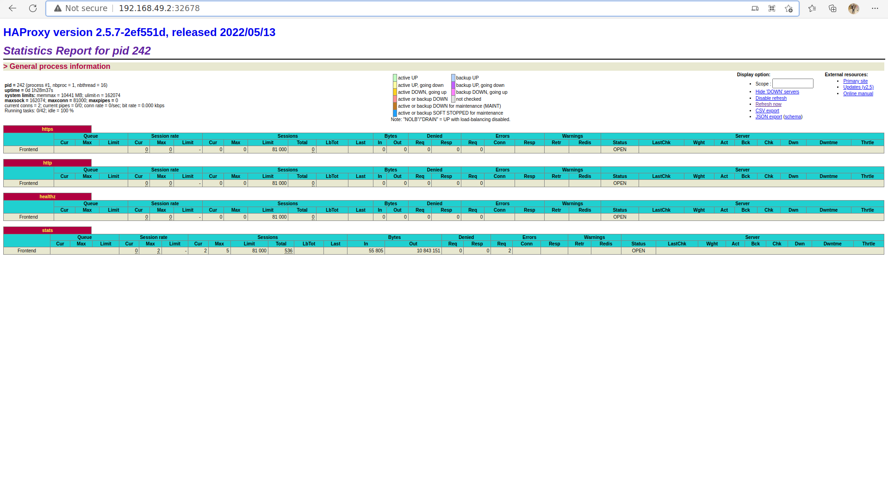

# Deploy haProxy App on Kubernetes
1- Create a namespace haproxy-controller-devops.
```bash
kubectl create namespace haproxy-controller-devops
```
2- Create a ServiceAccount haproxy-service-account-devops under the same namespace.
```yaml
apiVersion: v1
kind: ServiceAccount
metadata:
  name: haproxy-service-account-devops
  namespace: haproxy-controller-devops
```

3- Create a ClusterRole which should be named as haproxy-cluster-role-devops, to grant
permissions "get", "list", "watch", "create", "patch", "update" to
"Configmaps",”secrets”,"endpoints","nodes","pods","services",
"namespaces","events","serviceaccounts".

```yaml
apiVersion: rbac.authorization.k8s.io/v1
kind: ClusterRole
metadata:
  name: haproxy-cluster-role-devops

rules:
  - apiGroups: [""]
    resources: [
                "configmaps",
                "secrets",
                "endpoints",
                "nodes",
                "pods",
                "services",
                "namespaces",
                "events",
                "serviceaccounts"
                ]
    verbs: [
            "get",
            "list",
            "watch",
            "create",
            "patch",
            "update"
            ]
```

4- Create a ClusterRoleBinding which should be named as
haproxy-cluster-role-binding-devops under the same namespace. Define roleRef apiGroup
should be rbac.authorization.k8s.io, kind should be ClusterRole, name should be
haproxy-cluster-role-devops and subjects kind should be ServiceAccount, name should be
haproxy-service-account-devops and namespace should be haproxy-controller-devops.

```yaml
apiVersion: rbac.authorization.k8s.io/v1
kind: ClusterRoleBinding
metadata:
  name: haproxy-cluster-role-binding-devops
  namespace: haproxy-controller-devops

roleRef:
  kind: ClusterRole
  name: haproxy-cluster-role-devops
  apiGroup: rbac.authorization.k8s.io

subjects:
  - kind: ServiceAccount
    name: haproxy-service-account-devops
    namespace: haproxy-controller-devops
```
5- Create a backend deployment which should be named as backend-deployment-devops
under the same namespace, labels run should be ingress-default-backend under metadata.
Configure spec as replica should be 1, selector's matchLabels run should be
ingress-default-backend. Template's labels run under metadata should be
ingress-default-backend. The container should named as backend-container-devops, use
image gcr.io/google_containers/defaultbackend:1.0 ( use exact name of image as
mentioned ) and its containerPort should be 8080.

```yaml
apiVersion: apps/v1
kind: Deployment
metadata:
  name: backend-deployment-devops
  namespace: haproxy-controller-devops
  labels:
    run: ingress-default-backend

spec:
  replicas: 1
  selector:
    matchLabels:
      run: ingress-default-backend
    
  
  template:
 
    metadata:
      name: backend-deployment-devops
      labels:
        run: ingress-default-backend

    
    spec:
      containers:
      - name: backend-container-devops
        image: gcr.io/google_containers/defaultbackend:1.0
        ports:
        - containerPort: 8080
```

6- Create a service for backend which should be named as service-backend-devops under
the same namespace, labels run should be ingress-default-backend. Configure spec as
selector's run should be ingress-default-backend, port should be named as port-backend,
protocol should be TCP, port should be 8080 and targetPort should be 8080.

```yaml
apiVersion: v1
kind: Service
metadata: 
  name: service-backend-devops
  namespace: haproxy-controller-devops
  labels:
    run: ingress-default-backend

spec:
  selector:
    run: ingress-default-backend

  ports:
  - name: port-backend
    protocol: TCP
    port: 8080
    targetPort: 8080

```

7- Create a deployment for frontend which should be named haproxy-ingress-devops
under the same namespace. Configure spec as replica should be 1, selector's matchLabels
should be haproxy-ingress, template's labels run should be haproxy-ingress under
metadata. The container name should be ingress-container-devops under the same service
account haproxy-service-account-devops, use image haproxytech/kubernetes-ingress, give
args as --default-backend-service=haproxy-controller-devops/service-backend-devops,
resources requests for cpu should be 500m and for memory should be 50Mi, livenessProbe
httpGet path should be /healthz its port should be 1024. The first port name should be http
and its containerPort should be 80, second port name should be https and its
containerPort should be 443 and third port name should be stat its containerPort should
be 1024. Define environment as first env name should be TZ its value should be Etc/UTC,
second env name should be POD_NAME itsvalueFrom:
fieldRef:
fieldPath: should be metadata.name and third env name should be POD_NAMESPACE
its
valueFrom:
fieldRef:
fieldPath: should be metadata.namespace.

```yaml
apiVersion: apps/v1
kind: Deployment
metadata:
  name: haproxy-ingress-devops
  namespace: haproxy-controller-devops
  labels:
    run: ingress-default-backend


spec:
  replicas: 1
  selector:
    matchLabels:
      run: haproxy-ingress
  template:
    metadata:
      labels:
        run: haproxy-ingress


    spec:
      serviceAccountName: haproxy-service-account-devops
      containers:
      - name: ingress-container-devops
        image: haproxytech/kubernetes-ingress
        
        resources:
          requests:
            memory: "50Mi"
            cpu: "500m"
        
        
        ports:
        - name: http
          containerPort: 80
        - name: https
          containerPort: 443
        - name: stat
          containerPort: 1024
        
        args: ["--default-backend-service=haproxy-controller-devops/service-backend-devops"]
        
        
        livenessProbe:
          httpGet:
            path: /healthz
            port: 1024
        
        env:
          - name: TZ
            value: Etc/UTC

          - name: POD_NAME
            valueFrom:
              fieldRef:
                fieldPath: metadata.name
          
          - name: POD_NAMESPACE
            valueFrom:
              fieldRef:
                fieldPath: metadata.namespace
```

8- Create a service for frontend which should be named as ingress-service-devops under
same namespace, labels run should be haproxy-ingress. Configure spec as selectors' run
should be haproxy-ingress, type should be NodePort. The first port name should be http,
its port should be 80, protocol should be TCP, targetPort should be 80 and nodePort should
be 32456. The second port name should be https, its port should be 443, protocol should
be TCP, targetPort should be 443 and nodePort should be 32567. The third port name
should be stat, its port should be 1024, protocol should be TCP, targetPort should be 1024
and nodePort should be 32678.

```yaml
apiVersion: v1
kind: Service
metadata:
  name: ingress-service-devops
  namespace: haproxy-controller-devops
  labels:
    run: haproxy-ingress

spec:
  type: NodePort
  selector:
    run: haproxy-ingress

  ports:

  - name: http
    port: 80
    protocol: TCP
    targetPort: 80
    nodePort: 32456
  
  - name: https
    port: 443
    protocol: TCP
    targetPort: 443
    nodePort: 32567
  
  - name: stat
    port: 1024
    protocol: TCP
    targetPort: 1024
    nodePort: 32678
```
Check the endpoints
```bash
amir@amir-Alienware-x15-R1:~/K8SminiProject$ kubectl get endpoints --namespace=haproxy-controller-devops
NAME                     ENDPOINTS                                      AGE
ingress-service-devops   172.17.0.6:443,172.17.0.6:80,172.17.0.6:1024   22m
service-backend-devops   172.17.0.2:8080                                22m
```
Check the minikube IP to access on the browser
```bash
amir@amir-Alienware-x15-R1:~/K8SminiProject$ minikube ip
192.168.49.2
```


